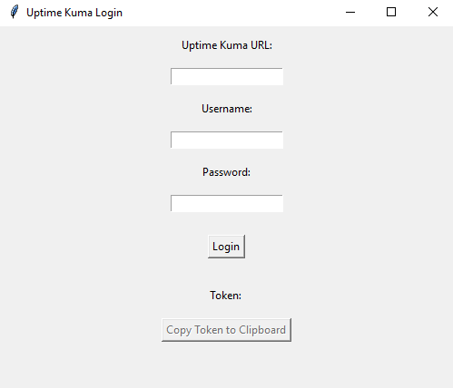

# UptimeKuma-Token-Generator

This application is used to generate a token for Uptime Kuma. This token can then be used to listen to heartbeat events and execute certain actions on the Uptime Kuma server.

## Usage
There is an executable [in the latest releases](https://github.com/totoluto/UptimeKuma-Token-Generator/latest) which can be executed. After downloading and launching the application, you can enter the URL of your Uptime-Kuma instance and log in as you would with your credentials. After you press the `Login` button you will get a Token which can then be used to listen to the Uptime-Kuma events.

## Why did I do this?
Well i developed a Magic Mirror Plugin and I wanted to make the login process as easy as possible for less advanced Users. With this they can download and install their plugin whitout making get requests to their Uptime-Kuma instance and weirdly fetching it from the response.